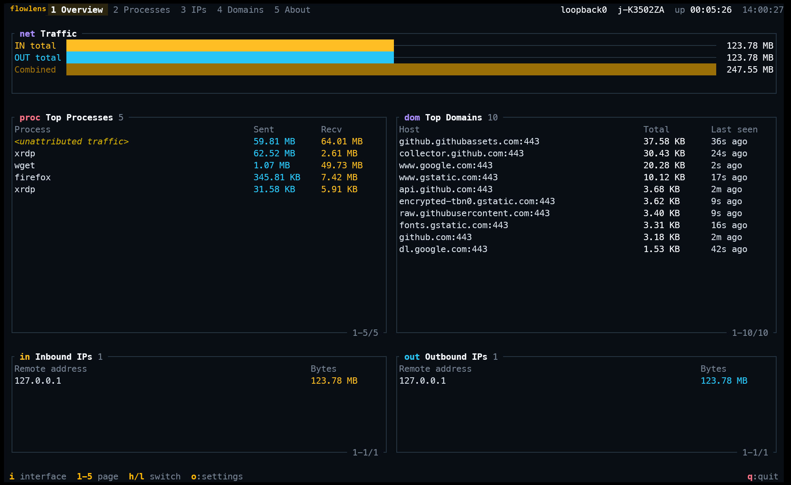

# FlowLens

English | [简体中文](README_CN.md)

FlowLens is a command-line network traffic analyzer for resource-constrained Linux and Windows hosts. It shows interface traffic and provides best-effort process, IP, and outbound-domain attribution.



## Supported platforms

| Platform | Runtime requirements |
| --- | --- |
| Linux `x86_64` | glibc `2.28` or newer, libpcap, and root or `CAP_NET_RAW` |
| Linux `aarch64` | glibc `2.28` or newer, libpcap, and root or `CAP_NET_RAW` |
| Windows `x86_64` | Windows with [Npcap Runtime](https://npcap.com/) installed |
| Windows `aarch64` | Windows on ARM with [Npcap Runtime](https://npcap.com/) installed |

Windows `x86_64`/`aarch64` and Linux `x86_64`/`aarch64` are supported release platforms. Support means that the core functions and basic stability meet the minimum acceptance bar; it does not mean that every boundary condition has been exhaustively tested.

## Install

Download the archive for the target operating system and CPU architecture from the [GitHub Releases](https://github.com/power4j/flowlens/releases/latest) page and extract the single executable inside it.

### Linux

Install the libpcap runtime if it is not already available:

```bash
# Debian or Ubuntu
sudo apt install libpcap0.8

# RHEL-compatible distributions
sudo dnf install libpcap
```

Run FlowLens as root, or grant the executable `CAP_NET_RAW`:

```bash
sudo ./flowlens
# or
sudo setcap cap_net_raw+ep ./flowlens
./flowlens
```

### Windows

Install [Npcap](https://npcap.com/) before starting FlowLens. The Windows archive contains only `flowlens.exe`; it does not include Npcap Runtime.

FlowLens checks for `wpcap.dll` at startup and reports a missing Npcap Runtime before opening a capture device.

## Usage

Start the foreground TUI without selecting an interface:

```bash
./flowlens
```

Start directly on an interface:

```bash
./flowlens eth0
```

Write periodic plain-text snapshots to a file:

```bash
./flowlens eth0 --output /tmp/stats.txt
```

Stream JSON Lines to standard output:

```bash
./flowlens eth0 --format json
```

Write JSON snapshots to a file:

```bash
./flowlens eth0 --format json --output /tmp/stats.json
```

Limit each top-N list:

```bash
./flowlens eth0 --top-n 3
```

Write process-attribution diagnostics as JSONL to the default `.log` file:

```bash
./flowlens eth0 --format json --diagnostics
```

Specify the diagnostics output file:

```bash
./flowlens eth0 --diagnostics --diagnostics-output /tmp/flowlens-diagnostics.jsonl
```

In TUI mode, diagnostics are written to this file and never to the terminal.

Use `flowlens --help` for the complete option list.

## What it shows

- Interface totals for inbound, outbound, and combined traffic.
- Top processes with process name, PID, traffic totals, and best-effort executable identity.
- Top remote IP addresses.
- Outbound domains identified from TLS SNI or plaintext HTTP `Host` headers on locally initiated TCP connections.
- TUI, plain-text, JSON, and JSON Lines output modes.

## Known limitations

Process attribution is best-effort. Permissions, network namespaces, containers, WSL proxy paths, port reuse, and process-table timing can leave traffic under `<unattributed traffic>`.

Outbound-domain statistics cover TCP TLS ClientHello SNI and plaintext HTTP/1.x `Host` headers. They do not cover QUIC/HTTP3, inbound-initiated connections, encrypted SNI, or payloads that cannot be parsed.

Loopback capture can show the same transfer as both inbound and outbound traffic. This reflects the operating system's capture semantics and does not mean that the public transfer happened twice.

The process attribution and capture behavior may differ between Linux and Windows. The release notes document platform-specific prerequisites and known limitations for each version.

## License

FlowLens is licensed under the [Apache License 2.0](LICENSE).

For development and source-build instructions, see [`docs/development.md`](docs/development.md).
