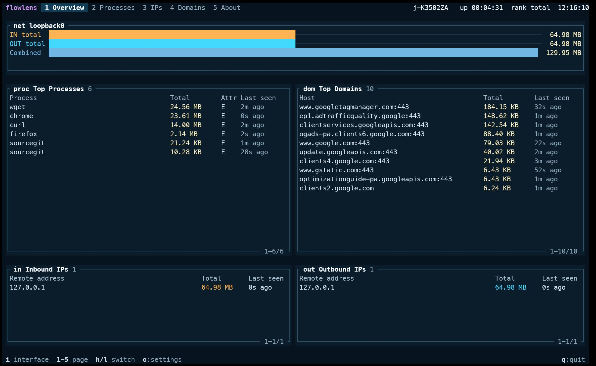
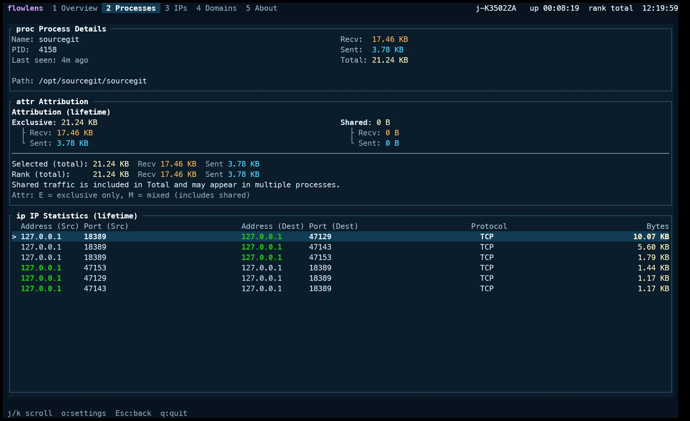
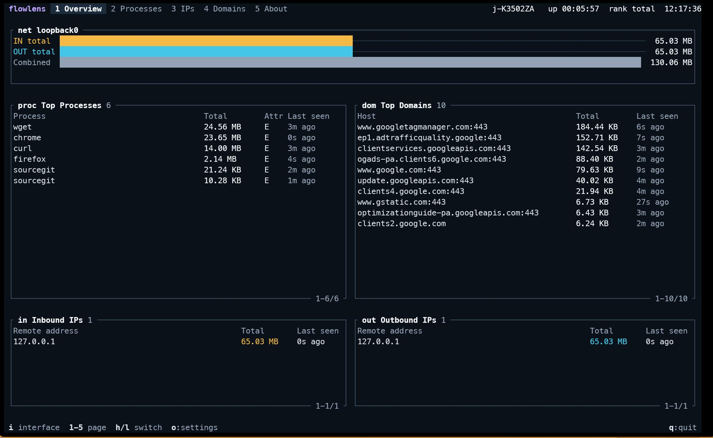
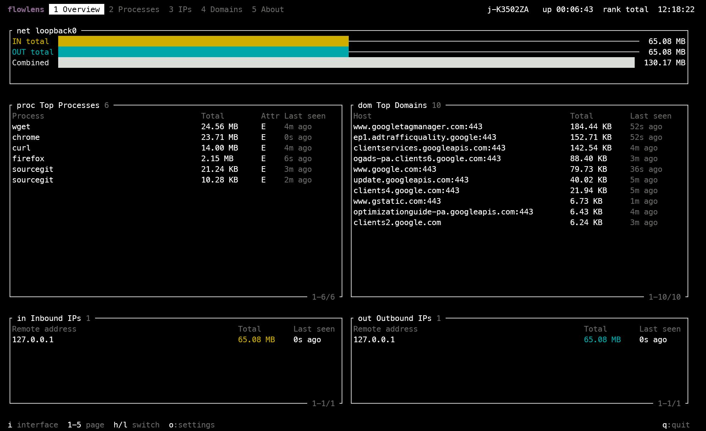
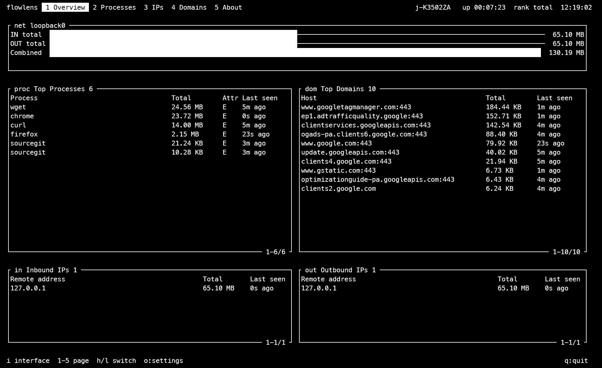

# FlowLens

[English](README.md) | 简体中文

FlowLens 是面向资源受限 Linux 和 Windows 主机的命令行网络流量分析工具，用于查看网卡流量，并以尽力而为的方式提供进程、IP 和出站域名归属信息。项目同时提供实验性 macOS 构建。



*Signal Deck 主题下的流量总览。*

## 功能亮点

- **一屏总览。** 同时查看网卡流量总量、流量最高的进程、远端 IP 和出站域名。
- **可解释的进程归属。** 区分独占、共享、系统和未归属流量，并提供流量守恒摘要。
- **进程详情。** 查看 PID、可执行文件路径、最后活跃时间、归属构成，以及按流量排序的双向 TCP/UDP 端点流。
- **可配置排行窗口。** 在累计总量与 5 秒、10 秒、30 秒、60 秒或 5 分钟平均吞吐量之间切换；有限窗口会显示预热覆盖率。
- **出站域名识别。** 从本机发起的 TCP 连接中提取 TLS ClientHello SNI 和明文 HTTP/1.x `Host` 头。
- **交互式网卡选择。** 在 TUI 中切换抓包网卡，并查看网卡的 IPv4 和 IPv6 地址。
- **多种输出方式。** 支持交互式 TUI、纯文本快照、JSON Lines 流、格式化 JSON 文件和独立的 JSONL 诊断日志。
- **跨平台与主题支持。** 支持 Linux 和 Windows 发布版本，提供 `x86_64`、`aarch64` 实验性 macOS 构建，并内建四种主题和自定义 JSON 主题。

## 进程详情

进入进程详情页，可以查看进程身份、归属构成、流量总量和按流量排序的端点流。



## 内建主题

FlowLens 提供四种主题，适配真彩色、ANSI 16 色和单色终端。`Auto` 会根据检测到的终端能力选择内建主题。主题选择行为和自定义 JSON 主题见 [TUI 主题](docs/theme.md)。

<table>
  <tr>
    <th width="50%">FlowLens Dark</th>
    <th width="50%">Signal Deck</th>
  </tr>
  <tr>
    <td></td>
    <td></td>
  </tr>
  <tr>
    <th>ANSI 16</th>
    <th>Mono</th>
  </tr>
  <tr>
    <td></td>
    <td></td>
  </tr>
</table>

## 支持的平台

| 平台 | 可用性与运行前置条件 |
| --- | --- |
| Linux `x86_64` | glibc `2.28` 或更新版本、libpcap，以及 root 权限或 `CAP_NET_RAW` |
| Linux `aarch64` | glibc `2.28` 或更新版本、libpcap，以及 root 权限或 `CAP_NET_RAW` |
| Windows `x86_64` | 已安装 [Npcap Runtime](https://npcap.com/) 的 Windows 系统 |
| Windows `aarch64` | 已安装 [Npcap Runtime](https://npcap.com/) 的 Windows on ARM 系统 |
| macOS `x86_64` | 实验性、未签名、未经公证的压缩包；尚未验证最低 macOS 版本和完整运行行为 |
| macOS `aarch64` | 实验性、未签名、未经公证的压缩包；尚未验证最低 macOS 版本和完整运行行为 |

FlowLens 支持 Linux `x86_64`/`aarch64`、Windows `x86_64`/`aarch64` 和 macOS `x86_64`/`aarch64`。Linux 和 Windows 版本的核心功能与基本稳定性已达到最低验收线，但不表示所有边界情况都已完成穷尽测试。macOS 支持目前为实验性，尚未完成同等程度的运行验证。

## 安装

Linux `x86_64` 和 `aarch64` 可以使用安装脚本。默认命令安装最新稳定版到 `~/.local/bin`，并在当前 Bash 或 Zsh 可识别时维护 PATH：

```bash
curl -fsSL https://raw.githubusercontent.com/power4j/flowlens/main/install.sh | bash
```

也可以先下载脚本审查，再安装指定版本：

```bash
curl -fsSL https://raw.githubusercontent.com/power4j/flowlens/main/install.sh -o install.sh
less install.sh
bash install.sh --version v0.3.0
```

管道传参示例：

```bash
curl -fsSL https://raw.githubusercontent.com/power4j/flowlens/main/install.sh | bash -s -- --version v0.3.0
```

安装器需要 Bash 3.2+、`curl`、`tar`，以及 `sha256sum` 或 `shasum`。它不会自动安装 `libpcap`。安装器仅支持 Linux，并会拒绝在 macOS 上安装。Windows 和实验性 macOS 构建使用下面的压缩包。

从 [GitHub Releases](https://github.com/power4j/flowlens/releases/latest) 下载对应操作系统和 CPU 架构的压缩包，解压其中唯一的可执行文件即可。

### Linux

如果系统尚未安装 libpcap 运行库，请先安装：

```bash
# Debian 或 Ubuntu
sudo apt install libpcap0.8

# RHEL 兼容发行版
sudo dnf install libpcap
```

以 root 身份运行 FlowLens，或者为可执行文件授予 `CAP_NET_RAW`：

```bash
sudo ./flowlens
# 或
sudo setcap cap_net_raw+ep ./flowlens
./flowlens
```

### Windows

启动 FlowLens 前请安装 [Npcap](https://npcap.com/)。Windows 压缩包只包含 `flowlens.exe`，不包含 Npcap Runtime。

FlowLens 启动时会检查 `wpcap.dll`。如果缺少 Npcap Runtime，程序会在打开抓包设备前报告错误。

### macOS（实验性）

Intel Mac 从 [GitHub Releases](https://github.com/power4j/flowlens/releases/latest) 下载 `flowlens-vX.Y.Z-macos-x86_64.tar.gz`，Apple Silicon 下载 `flowlens-vX.Y.Z-macos-aarch64.tar.gz`，然后解压其中的 `flowlens`。`install.sh` 不支持这些实验性压缩包。

macOS 二进制文件未签名且未经公证，因此 macOS 可能阻止运行或显示警告。运行前应审查下载的压缩包，并遵守目标 Mac 的安全策略。FlowLens 当前不提供已签名构建。

两个架构均在 GitHub 托管的原生 macOS runner 上构建，并通过 `file`、`otool`、`flowlens --help` 和 `flowlens --version` 基础检查。由于缺少完整的 macOS 运行验证环境，真实抓包、权限、网卡行为、进程归属、长时间稳定性、性能和最低支持的 macOS 版本尚未完成充分测试。

## 使用

不指定网卡，直接启动前台 TUI：

```bash
./flowlens
```

直接打开指定网卡：

```bash
./flowlens eth0
```

选择内建 TUI 主题、按名称加载用户主题，或加载指定 JSON 主题文件：

```bash
./flowlens --theme ansi16
./flowlens --theme ocean
./flowlens eth0 --theme ./my-theme.json
```

`--theme` 只适用于前台交互 TUI。主题选择、自动行为和 JSON 主题编写见 [TUI 主题](docs/theme.md)。

将定时生成的 plain 文本快照写入文件：

```bash
./flowlens eth0 --output /tmp/stats.txt
```

将 JSON Lines 流写入标准输出：

```bash
./flowlens eth0 --format json
```

将 JSON 快照写入文件：

```bash
./flowlens eth0 --format json --output /tmp/stats.json
```

限制每个 top-N 列表的条目数：

```bash
./flowlens eth0 --top-n 3
```

将进程归属诊断信息以 JSONL 格式写入默认 `.log` 文件：

```bash
./flowlens eth0 --format json --diagnostics
```

指定诊断输出文件：

```bash
./flowlens eth0 --diagnostics --diagnostics-output /tmp/flowlens-diagnostics.jsonl
```

TUI 模式下诊断信息同样只写入该文件，不写入终端屏幕。

完整参数列表请运行 `flowlens --help` 查看。

## 已知限制

进程归属采用尽力而为策略。权限、网络命名空间、容器、WSL 代理路径、端口复用和进程表时序都可能使部分流量进入 `<unattributed traffic>`。

出站域名统计覆盖 TCP TLS ClientHello SNI 和明文 HTTP/1.x `Host` 头，不覆盖 QUIC/HTTP3、入站发起的连接、加密 SNI 和无法解析的 payload。

loopback 抓包可能同时显示同一传输的入站和出站流量。这是操作系统的抓包语义，不表示公网传输实际发生了两次。

Linux、Windows 和 macOS 的进程归属及抓包行为可能存在差异。macOS 构建仍受上述验证范围限制，属于实验性版本。每个版本的 Release Notes 会说明平台前置条件和已知限制。

## 许可证

FlowLens 使用 [Apache License 2.0](LICENSE) 许可证。

开发和源码构建说明见 [`docs/development.md`](docs/development.md)。
