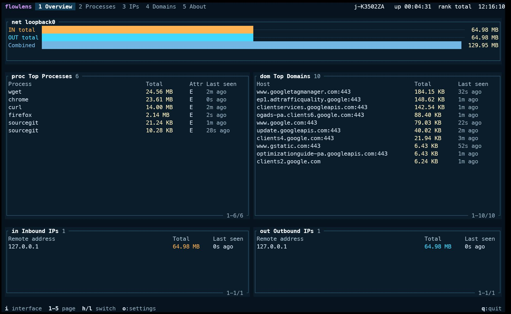
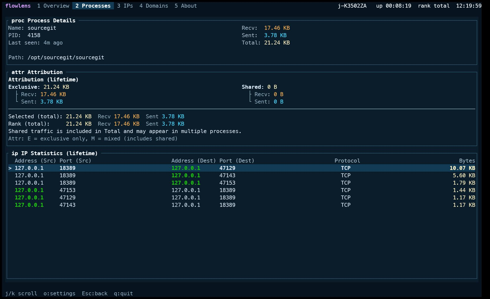
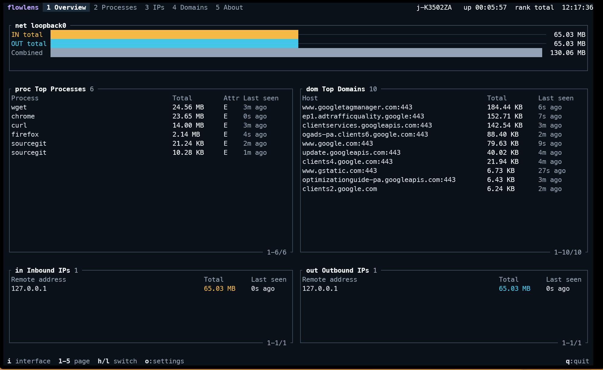
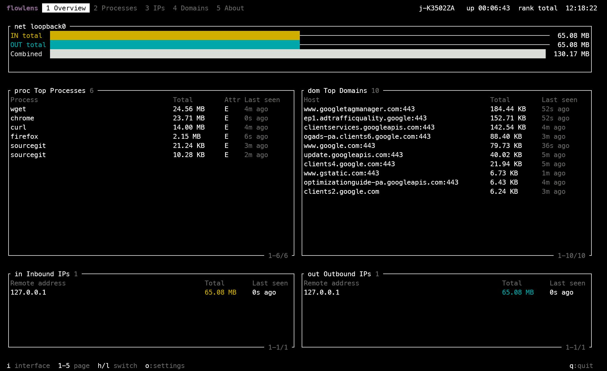
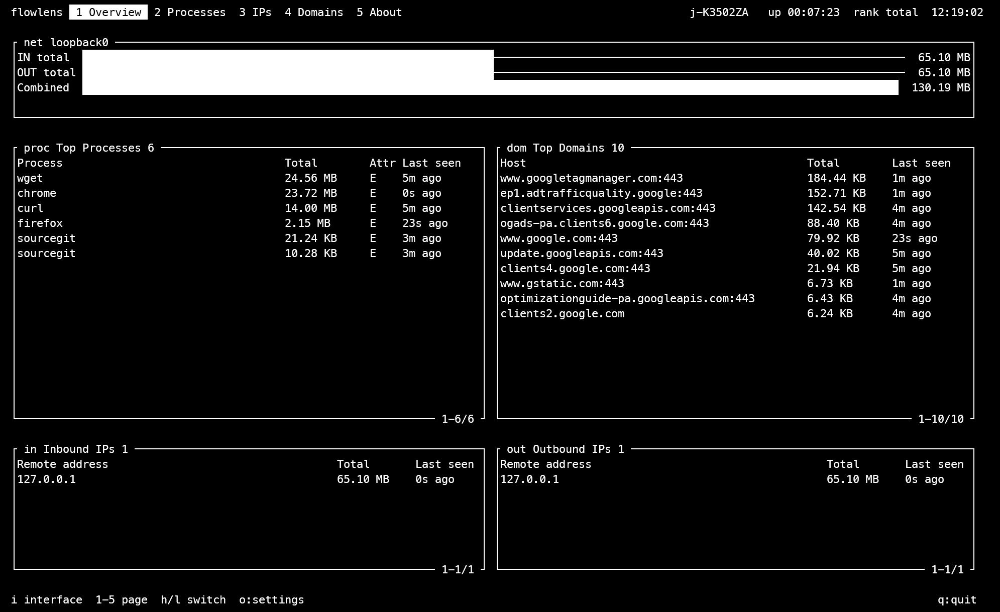

# FlowLens

[English](README.md) | 简体中文

FlowLens 是面向资源受限 Linux 和 Windows 主机的命令行网络流量分析工具，用于查看网卡流量，并以尽力而为的方式提供进程、IP 和出站域名归属信息。项目同时提供实验性 macOS 构建。



*Signal Deck 主题下的流量总览。*

## 功能亮点

- **一屏总览。** 同时查看网卡流量总量、流量最高的进程、远端 IP 和出站域名。
- **可解释的进程归属。** 区分独占、共享、系统和未归属流量，并提供流量守恒摘要。
- **进程详情。** 查看 PID、可执行文件路径、最后活跃时间、归属构成，以及按流量排序的双向 TCP/UDP 端点流。
- **可配置排行窗口。** 在累计总量与 5 秒、10 秒、30 秒、60 秒或 5 分钟平均吞吐量之间切换；有限窗口会显示预热覆盖率。
- **出站域名识别。** 从本机发起的 TCP 连接中提取 TLS ClientHello SNI 和明文 HTTP/1.x `Host` 头。
- **交互式网卡选择。** 在 TUI 中切换抓包网卡，并查看网卡的 IPv4 和 IPv6 地址。
- **多种输出方式。** 支持交互式 TUI、纯文本快照、JSON Lines 流、格式化 JSON 文件和独立的 JSONL 诊断日志。
- **跨平台与主题支持。** 支持 Linux 和 Windows 发布版本，提供 `x86_64`、`aarch64` 实验性 macOS 构建，并内建四种主题和自定义 JSON 主题。

## 进程详情

进入进程详情页，可以查看进程身份、归属构成、流量总量和按流量排序的端点流。



## 内建主题

FlowLens 提供四种主题，适配真彩色、ANSI 16 色和单色终端。`Auto` 会根据检测到的终端能力选择内建主题。主题选择行为和自定义 JSON 主题见 [TUI 主题](docs/theme.md)。

<table>
  <tr>
    <th width="50%">FlowLens Dark</th>
    <th width="50%">Signal Deck</th>
  </tr>
  <tr>
    <td></td>
    <td></td>
  </tr>
  <tr>
    <th>ANSI 16</th>
    <th>Mono</th>
  </tr>
  <tr>
    <td></td>
    <td></td>
  </tr>
</table>

## 支持的平台

| 平台 | 可用性与运行前置条件 |
| --- | --- |
| Linux `x86_64` | glibc `2.28` 或更新版本，以及 root 权限或 `CAP_NET_RAW`；旧动态链接压缩包还需要匹配的 libpcap |
| Linux `aarch64` | glibc `2.28` 或更新版本，以及 root 权限或 `CAP_NET_RAW`；旧动态链接压缩包还需要匹配的 libpcap |
| Windows `x86_64` | 已安装 [Npcap Runtime](https://npcap.com/) 的 Windows 系统 |
| Windows `aarch64` | 已安装 [Npcap Runtime](https://npcap.com/) 的 Windows on ARM 系统；交叉构建与二进制审计通过，ARM64 实机抓包尚未验证 |
| macOS `x86_64` | 实验性、未签名、未经公证的压缩包；尚未验证最低 macOS 版本和完整运行行为 |
| macOS `aarch64` | 实验性、未签名、未经公证的压缩包；尚未验证最低 macOS 版本和完整运行行为 |

FlowLens 支持 Linux `x86_64`/`aarch64`、Windows `x86_64`/`aarch64` 和 macOS `x86_64`/`aarch64`。Linux 和 Windows 版本的核心功能与基本稳定性已达到最低验收线，但不表示所有边界情况都已完成穷尽测试。macOS 支持目前为实验性，尚未完成同等程度的运行验证。

## 安装

Linux `x86_64` 和 `aarch64` 可以使用安装脚本。默认命令安装最新稳定版到 `/usr/local/bin`，安装清单位于 `/usr/local/share/flowlens`。Linux 系统安装仅授予 `CAP_NET_RAW`，普通用户可以直接启动抓包，无需 sudo：

```bash
curl -fsSL https://raw.githubusercontent.com/power4j/flowlens/main/install.sh | sudo bash
flowlens
```

也可以先下载脚本审查，再安装指定版本：

```bash
curl -fsSL https://raw.githubusercontent.com/power4j/flowlens/main/install.sh -o install.sh
less install.sh
sudo bash install.sh --version v0.3.0
```

管道传参示例：

```bash
curl -fsSL https://raw.githubusercontent.com/power4j/flowlens/main/install.sh | sudo bash -s -- --version v0.3.0
```

不使用 sudo，显式传入 `--user` 可保留原来的 `~/.local/bin` 安装方式，并在需要时配置 Bash 或 Zsh 的 PATH：

```bash
bash install.sh --user
sudo "$HOME/.local/bin/flowlens"
```

修改当前 shell 的 PATH 不会改变 sudo 的命令搜索路径；用户安装应使用上面的绝对路径启动。`--system` 显式选择默认的系统安装范围，不能与 `--user` 或自定义目录同时使用。单独指定 `--install-dir DIR` 或 `FLOWLENS_INSTALL_DIR` 仍保留自定义目录行为，安装清单位于用户目录 `~/.local/share/flowlens`；命令行目录优先于环境变量。安装器内部仅尝试非交互式 `sudo -n`。系统目录不可写时，它会报错并提示使用 sudo 运行脚本或选择 `--user`，不会自动询问密码，也不会回退到用户安装。

卸载安装器管理的系统版本，使用 `sudo bash install.sh --uninstall`。卸载用户版本，必须由原用户执行 `bash install.sh --user --uninstall`，不要加 sudo。自定义安装需传入安装时使用的目录参数或环境变量。

从现有用户安装迁移时，先下载新版脚本，确认系统版本可用后再清理旧版本：

```bash
curl -fsSL https://raw.githubusercontent.com/power4j/flowlens/main/install.sh -o install.sh
sudo bash install.sh
/usr/local/bin/flowlens --version
/usr/local/bin/flowlens
# 确认成功启动后退出 FlowLens，再由原用户执行，不要加 sudo：
bash install.sh --user --uninstall
# 重新打开 shell，确认以下命令解析到 /usr/local/bin/flowlens：
command -v flowlens
```

系统安装会保留原有的 `~/.local/bin/flowlens`，并提示它可能在 shell 中优先于系统版本被找到。上述清理命令仅适用于安装器管理的旧版本；手动安装的旧版本应在验证系统版本后自行检查并清理。

安装器需要 Bash 3.2+、`curl`、`tar`、`ldd`，以及 `sha256sum` 或 `shasum`。新的 Linux 发布构建内嵌 libpcap；已经发布的旧动态链接压缩包仍需要匹配的运行库。下载校验和安装预检通过后，默认系统安装仅在二进制确实需要时自动准备缺失的 libpcap 运行库：Debian/Ubuntu 使用 `apt-get`，优先选择可用的 `libpcap0.8t64`，旧版本使用 `libpcap0.8`；RPM 系发行版使用 `dnf` 或 `yum` 安装 `libpcap`。不会安装开发包。包管理操作为非交互式，需要 root 或可用的 `sudo -n`，且不会读取管道中的脚本输入。安装器仅支持 Linux，并会拒绝在 macOS 上安装。Windows 和实验性 macOS 构建使用下面的压缩包。

从 [GitHub Releases](https://github.com/power4j/flowlens/releases/latest) 下载对应操作系统和 CPU 架构的压缩包，解压其中唯一的可执行文件即可。

### Linux

#### 安装器运行库与抓包权限

默认 Linux 系统安装和显式 `--system` 安装仅授予 `cap_net_raw+ep`，不会授予 `CAP_NET_ADMIN`。下载校验和安装预检通过后，系统安装会准备缺失的 `setcap` 工具（Debian/Ubuntu 的 `libcap2-bin`，RPM 系的 `libcap`）。安装成功后，以普通用户启动抓包：

```bash
flowlens
# 如果找到了其他版本：
/usr/local/bin/flowlens
```

升级或重装时，重新执行同一默认命令即可。每次替换后的二进制都会重新获得 `CAP_NET_RAW`，无需额外传入 `--setcap`：

```bash
sudo bash install.sh
flowlens
```

若要保留仅通过 sudo 抓包的方式，请在每次安装或升级时传入 `--no-setcap`：

```bash
sudo bash install.sh --no-setcap
sudo flowlens
# 如果 sudo 找不到命令，或找到了其他版本：
sudo /usr/local/bin/flowlens
```

`FLOWLENS_SETCAP=true` 显式开启能力授权，`FLOWLENS_SETCAP=false` 关闭授权。命令行 `--setcap` 或 `--no-setcap` 优先于环境变量；两个参数同时传入会报错。用户或自定义目录安装默认不授予能力；手动准备好工具和权限后，仍可显式使用 `--setcap`。

`--user` 和自定义目录安装不会修改系统软件包，即使以 root 运行也不会。依赖缺失时会停止安装并给出手动准备命令。`--dry-run` 和 `--uninstall` 不会修改软件包，试运行也不会授予能力。不支持的发行版或包管理器需要手动准备依赖。包管理失败会阻止发布二进制文件，但已安装的软件包不会回滚。

Linux 发布构建静态链接固定版本的 libpcap，无需系统 libpcap 软件包；glibc 仍为动态链接，基线保持 `2.28`。本地源码构建和旧发布版本仍可能动态链接 libpcap。安装器根据已校验二进制文件的加载器要求确认依赖，而不是仅检查包名。部分 RPM 系统提供 `libpcap.so.1`，而发布包可能需要 `libpcap.so.0.8`；如果仍无法满足实际要求，安装会停止。不要在不同 SONAME 之间创建兼容性符号链接。

#### 手动安装 Linux 压缩包

手动解压压缩包后，先检查依赖：

```bash
ldd ./flowlens
```

只有显示缺少 libpcap 依赖的旧版或动态链接压缩包，才需要安装匹配的系统运行库：

```bash
# Debian/Ubuntu：刷新元数据并检查可用的运行库包
sudo apt-get update
apt-cache policy libpcap0.8t64 libpcap0.8
# 现代 Debian/Ubuntu，libpcap0.8t64 存在候选版本时：
sudo apt-get install -y libpcap0.8t64
# 较旧的 Debian/Ubuntu，改用：
sudo apt-get install -y libpcap0.8
# RPM 系发行版（必要时将 dnf 替换为 yum）：
sudo dnf install -y libpcap
```

在解压目录检查依赖，然后以 root 身份启动抓包：

```bash
ldd ./flowlens
sudo ./flowlens
```

也可以手动安装 `setcap` 工具（Debian/Ubuntu 的 `libcap2-bin`，RPM 系的 `libcap`），再主动授予能力：

```bash
sudo setcap cap_net_raw+ep ./flowlens
./flowlens
```

### Windows

启动 FlowLens 前请安装 [Npcap](https://npcap.com/)。Windows 压缩包只包含 `flowlens.exe`，不包含 Npcap Runtime。

FlowLens 启动时会检查 `wpcap.dll`。如果缺少 Npcap Runtime，程序会在打开抓包设备前报告错误。

### macOS（实验性）

Intel Mac 从 [GitHub Releases](https://github.com/power4j/flowlens/releases/latest) 下载 `flowlens-vX.Y.Z-macos-x86_64.tar.gz`，Apple Silicon 下载 `flowlens-vX.Y.Z-macos-aarch64.tar.gz`，然后解压其中的 `flowlens`。`install.sh` 不支持这些实验性压缩包。

macOS 二进制文件未签名且未经公证，因此 macOS 可能阻止运行或显示警告。运行前应审查下载的压缩包，并遵守目标 Mac 的安全策略。FlowLens 当前不提供已签名构建。

两个架构均在 GitHub 托管的原生 macOS 15 runner 上构建，并明确沿用 Rust 1.96.0 默认部署目标（Intel 为 `10.12`，Apple Silicon 为 `11.0`），链接系统 libpcap 而非 Homebrew。CI 审计架构、部署目标及仅限系统库的动态依赖路径；测试构建和 Release 工作流还验证 root 回环抓包。这是构建基线，不代表已验证旧版 macOS 兼容性。普通用户抓包权限、其他网卡、进程归属、长时间稳定性和性能仍未完成充分测试。

## 使用

以下示例使用手动解压的 `./flowlens`。Linux 默认系统脚本安装后，请将 `./flowlens` 替换为 `flowlens`；使用 `--no-setcap` 安装后则用 `sudo flowlens`，用户安装使用上文所示的绝对路径命令。

不指定网卡，直接启动前台 TUI：

```bash
./flowlens
```

直接打开指定网卡：

```bash
./flowlens eth0
```

选择内建 TUI 主题、按名称加载用户主题，或加载指定 JSON 主题文件：

```bash
./flowlens --theme ansi16
./flowlens --theme ocean
./flowlens eth0 --theme ./my-theme.json
```

`--theme` 只适用于前台交互 TUI。主题选择、自动行为和 JSON 主题编写见 [TUI 主题](docs/theme.md)。

将定时生成的 plain 文本快照写入文件：

```bash
./flowlens eth0 --output /tmp/stats.txt
```

将 JSON Lines 流写入标准输出：

```bash
./flowlens eth0 --format json
```

将 JSON 快照写入文件：

```bash
./flowlens eth0 --format json --output /tmp/stats.json
```

限制每个 top-N 列表的条目数：

```bash
./flowlens eth0 --top-n 3
```

将进程归属诊断信息以 JSONL 格式写入默认 `.log` 文件：

```bash
./flowlens eth0 --format json --diagnostics
```

指定诊断输出文件：

```bash
./flowlens eth0 --diagnostics --diagnostics-output /tmp/flowlens-diagnostics.jsonl
```

TUI 模式下诊断信息同样只写入该文件，不写入终端屏幕。

完整参数列表请运行 `flowlens --help` 查看。

## 已知限制

进程归属采用尽力而为策略。权限、网络命名空间、容器、WSL 代理路径、端口复用和进程表时序都可能使部分流量进入 `<unattributed traffic>`。

出站域名统计覆盖 TCP TLS ClientHello SNI 和明文 HTTP/1.x `Host` 头，不覆盖 QUIC/HTTP3、入站发起的连接、加密 SNI 和无法解析的 payload。

loopback 抓包可能同时显示同一传输的入站和出站流量。这是操作系统的抓包语义，不表示公网传输实际发生了两次。

Linux、Windows 和 macOS 的进程归属及抓包行为可能存在差异。macOS 构建仍受上述验证范围限制，属于实验性版本。每个版本的 Release Notes 会说明平台前置条件和已知限制。

## 许可证

当前开发分支以及 v0.7.0 之后发布的所有 FlowLens 版本仅使用 [GNU General Public License 第 3 版](LICENSE)（`GPL-3.0-only`）。

Copyright (C) 2026 power4j。联系方式：power4j@outlook.com。

v0.7.0 及更早版本仍按各自发布时所附的 Apache License 2.0 授权。各贡献者的署名保留在 Git 历史中。静态 libpcap 工作流生成的 Linux 压缩包会在 `LICENSE` 中追加内嵌 libpcap 的许可证及版权声明。

开发和源码构建说明见 [`docs/development.md`](docs/development.md)。
